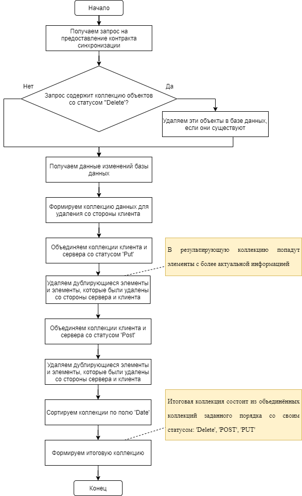
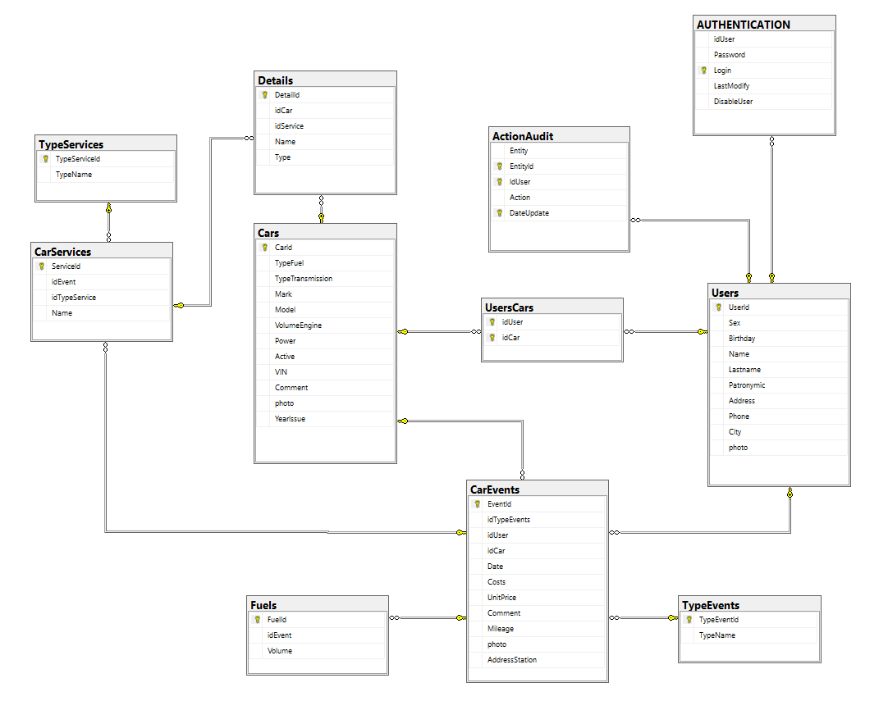
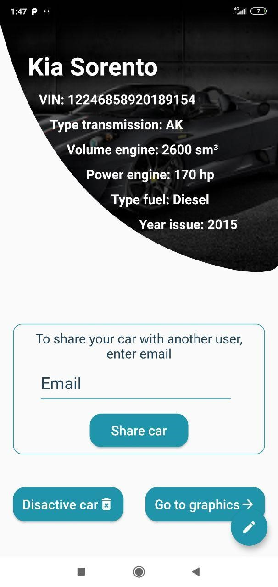
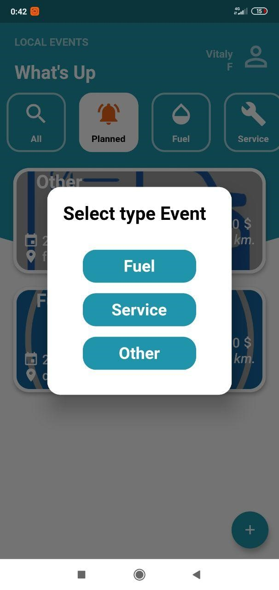
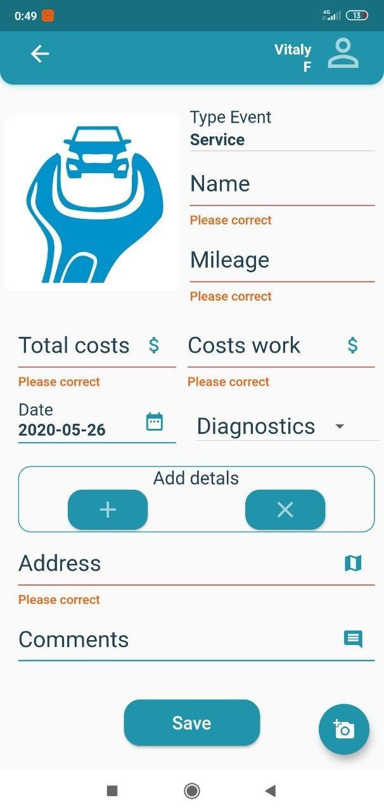

# Vehicle-logbook
<h2>Цель</h2>
Целью моего курсового проекта является создание приложения для учёта затрат и расходов на обслуживание автомобиля, а также хранения всех данных о предстоящих событиях, сервисе, характеристиках, пробеге автомобиля в одном месте.  <i>Для оптимизации затрат на эксплуатацию автомобиля данные также представлены в виде графиков и диаграмм.</i>
 
<h2>Вкратце о технической реализации</h2>
Мобильное приложение разработано c помощью платформы Flutter.  Сервер разработан на ASP.NET Core WEB Api. И предоставляет нам RESTFull API для взаимодействия. Для синхронизации данных удалёной базы данных и локальной базой данных клиента был разработан ASMX сервис использующий протокол SOAP.
<h4>Архитектура сервера</h4>

 
<i>
«FCM.Business» – библиотека классов, предоставляет сервисы для работы с базой данных. 
<h4>Схема классов данного проекта</h4>

 
«WebApi» – проект Asp.Net Core, предназначенный для создания удобного Api для работы клиента и сервера.
<h4>URI эндпоинтов</h4>

 
«SynchronizationService» – сервер, который предназначен для выдачи клиенту контракта синхронизации с помощью протокола SOAP.
<h4>Алгоритм работы синхрнизации со стороны сервера</h4>

<h4>Алгоритм работы синхрнизации со стороны клиента</h4>

</i>
 
Для хранения пользовательских данных используется реляционная база данных MS SQL Server. Для работы с локальной базы данных использовали SQFlite. Логирование всех действий происходит на уровне базы данных за счёт триггеров.
<h4>Схема базы данных:</h4>

 

<h2>Полный функционал приложения описан ниже:</h2>
<ul>
<li>Регистрация пользователя</li>
<li>Ввод данных пользователя</li>
<li>Авторизация пользователя</li>
<li>Создание индивидуального токена для работы с приложением</li>
<li>Предоставление списка событий для выбранного автомобиля</li>
<li>Добавление автомобилей пользователю</li>
<li>Предоставление другому пользователю доступа к автомобилю</li>
<li>Редактирование информации о пользователе/сервисах/автомобиле</li>
<li>Удаление информации о сервисах/автомобиле</li>
<li>Дезактивация автомобиля</li>
<li>Выбор активного автомобиля</li>
<li>Хранение и добавление событий для автомобиля</li>
<li>Вывод событий по категориям</li>
<li>Синхронизация данных между пользователями одного автомобиля</li>
<li>Предоставление наглядных отчётов в виде графиков и диаграмм</li>
</ul>
<h2>Диаграмма UML вариантов использования:</h2>
 

 
 
<h3>Ниже продемонстрирован функционал приложения:</h3>
 
Запустим приложение нажатием на иконку бортового журнала автомобиля. Первым делом откроется страница запуска приложения, на которой представлено название приложения, форма для регистрации и авторизации пользователя, а также ссылка на восстановление пароля
 

 
Для начала работы с приложением, новым пользователям необходимо зарегистрироваться, нажав на кнопку «Sign Up» и введя данные email-а и придумав надёжный пароль. Затем войти в мобильное приложение, нажав на кнопку «Sign In» и заполнив форму входа
 

 
После ввода корректных данных необходимо нажать на кнопку «Login», чтобы открыть главную страницу приложения. На данной странице представлены разделы меню бортового журнала автомобиля, такие как «All», «Planner», «Fuel», «Service», «Others». В верхнем левом углу расположена иконка, а также имя пользователя. В левом нижнем углу расположена кнопка для добавления новых событий, содержащих информацию о топливе, сервисе или другом типе события. Все компоненты главной страницы интерактивные, а также все кнопки являются кликабельными и содержат различные функции. 
 

 
При нажатии на иконку с фотографией пользователя на главной странице, открывается личный кабинет, в котором представлены его автомобили, при нажатии на кнопку в левом нижнем углу можно добавить новые транспортные средства. Также есть страница, содержащая личные данные пользователя – владельца автомобиля. Эти данные содержат такие поля, как фамилия, имя, отчество, год рождения, пол, номер телефона, город и адрес проживания. Также присутствует возможность добавления фотографии владельца формата .png, так как это компактный размер изображений и поддерживает сжатие файла без или с незначительными потерями. Изображение сохраняет исходное качество вне зависимости от интенсивности сжатия.
 

 
При нажатии на кнопку добавления нового транспортного средства, перед пользователем открывается страница с полями для ввода данных об автомобиле. Данные включают в себя информацию о марке и модели автомобиля, типе топлива, годе выпуска, мощности, типа коробки передач, количестве лошадиных сил и идентификационном номере машины. Также есть дополнительное поле для заметок об автомобиле и возможность добавления фотографии. После сохранения данных пользователь переходит на страницу автомобиля, где представлена сохранённая информация, а также поле для ввода email-а другого пользователя, которому можно отправить добавленное транспортное средство.
 

 
Внешний вид разделов приложения, которые содержат списки событий и функции добавления.
 

 
При нажатии на кнопку в нижней части приложения, появляется возможность добавления нового события
 

 
После выбора типа события открывается форма для заполнения подробной информации. В зависимости от типа события формы содержат разные поля для заполнения. 
Например, в форме информации о топливе, пользователю доступны такие поля, как тип топлива, стоимость, а также дата заправки автомобиля.
В форме с информацией о сервисе содержатся данные о стоимости работ, дату проведения, сведения о диагностике, а также адрес.
В форме «Другое» хранится информации о пользовательском типе события и присутствует обязательное поле «Комментарий» для названия события.
 

 
После добавления события и заполнения формы с информацией о нём, пользователю необходимо нажать на кнопку «Save» для сохранения данных. После этого перед ним открывается страница с информацией о текущем событии, а также с диаграммой статистики, автоматически построенной на основе введённых пользователем данных. 
 

 
При нажатии на кнопку «Go to graphics» пользователь переходит в раздел с общей статистикой, представленной в виде графиков и диаграмм. Каждый график и диаграмма строится автоматически на основе введённых владельцем данных, и содержит такую информацию, как месячное количество расходов на обслуживание транспортного средства, или дневная стоимость сервиса в текущем месяце.
 

 
На заднем фоне расположено изображение дороги, что ещё больше дополняет дизайн приложения, предназначенного для автомобилистов.
 

Использование функционала управления сессией приложения заключается в следующем:
<um>
<li>Определение, авторизован ли пользователь, и в зависимости от этого ему открывается либо экран авторизации, либо сразу новостная лента. Для этого используется SharedPreferences.</li>
<li>Завершение сессии приложения при выходе из приложения</li>
</um>
 
<h4>Реализованы следубщие требования:</h4>
<um>
<li>Всё то что я планировал реализовать</li>
<li>Плюссс что ниже :)</li>
<li>Минимальное количество экранов 8+</li>
<li>Использование хранилища (защитив данные) - Использование удаленного хранилища на базе SQL Server(логин, пароль), шифрование пароля алгоритмом AES</li>
<li>Защитить приложение авторизацией - реализовано (user входит в приложение под login и password выдаётся токен)</li>
<li>Реализовать защиту приложения – в приложении на любом из экранов нельзя делать скриншот</li>
<li>Обфускация приложения происходит при сборке, выполнив команду:  
<code>flutter build apk --target-platform android-arm,android-arm64,android-x64 --split-per-abi --obfuscate --split-debug-info=/'directory'</code></li>
</um>

